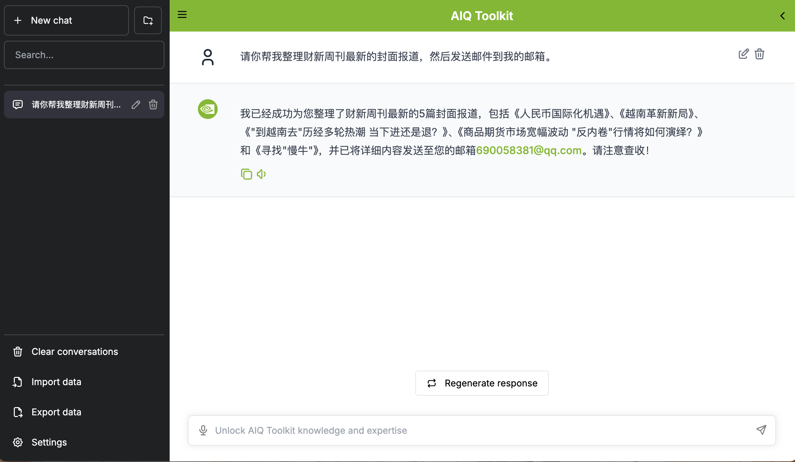

# NVIDIA Hackathon 财新周刊摘要邮件推送 agent

> 🏆 **黑客松项目** - 基于NVIDIA官方NeMo Agent Toolkit构建的财新周刊摘要邮件推送 agent，展示AI Agent的强大功能




## 🎯 项目简介
本项目基于NVIDIA官方NeMo Agent Toolkit的开发架构，实现了一个 React agent。

### Agent Workflow简介: 
- 自定义的`RedisMemoryEditor`继承了`aiq.memory.interfaces`中的`MemoryEditor`, 实现了插入`MemoryItem`和搜索`MemoryItem`的功能。`Memory`可以解决大模型 stateless 的问题，让agent 中间流转过程的大模型回答被后续的 tool/新的大模型调用利用。
- 自定义的`caixin_scrapper`工具抓取财新周刊封面报道信息，将摘要内容写入`memory`， 自定义的`email_newsletter`读取`memory`，将摘要内容写入正文，利用smtp服务发送邮件到用户邮箱。

### ✨ 核心特性
- 🤖 **官方架构**: 100%使用NVIDIA官方NeMo Agent Toolkit
- 🌐 **抓取财新周刊封面报道内容**: Python中的`httpx`发送请求，得到形式为json数组的内容，然后写入`memory`
- 📧 **smtp邮件服务**: 读取`memory`, 处理json内容转换为html, 结合`aiosmtplib`库发送邮件
- 🧬 **Redis实例实现Memory功能**: 继承实现`aiq.memory.interfaces`中的`MemoryEditor`中写入和读取功能
- 🎨 **现代界面**: 官方UI，支持实时对话和流式响应
- 🚀 **一键部署**: 跨平台安装脚本，支持Windows/Linux/macOS

## 🏗️ 技术架构

### 前端
- **框架**: Next.js 14 + TypeScript
- **UI库**: 官方[NeMo-Agent-Toolkit-UI](https://github.com/NVIDIA/NeMo-Agent-Toolkit-UI)
- **特性**: 实时聊天、主题切换、历史记录

### 后端
- **核心**: [NVIDIA NeMo Agent Toolkit (AIQ)](https://github.com/NVIDIA/NeMo-Agent-Toolkit/tree/develop)
- **工作流**: React Agent
- **工具**: caixin_scrapper, email_newsletter, mem0_memory, text_file_ingest
- **工具功能概要**
  - caixin_scrapper: 抓取财新周刊封面报道内容, 写入memory
  - email_newsletter: 读取 memory, 发送到用户邮箱
  - mem0_memory: 提供 memory 实例，实例化 add_items/search 功能
  - text_file_ingest: 搜索本地文件的内容并加载

### 后端工作目录
```
HACKATHON_AIQTOOLKIT
  └──NeMo-Agent-Toolkit
        ├── configs/
        │   └── hackathon_config.yml  #核心配置
        ├── mytools/
        │   ├── caixin_scrapper/      
        │   │   └── src/              
        │   ├── email_newsletter/     
        │   │   └── src/
        │   ├── mem0_memory/          
        │   │   └── src/
        │   └── text_file_ingest/     
        │       └── src/
        ├── start.sh
        └── stop.sh
```

## 🚀 快速开始
**Note:在启动之前需要将 baseline 版本，即比赛项目的初始版本跑通，确保环境和工具没有问题**

### ⚡ 一键启动
#### 克隆项目
#### 克隆主仓库
```bash
git clone https://github.com/siningsun/nvidia-hackathon-2025-caixin-email
cd hackathon_aiqtoolkit
```
#### 克隆子仓库
```bash
cd NeMo-Agent-Toolkit
git clone https://github.com/siningsun/nvidia-hackathon-2025-caixin-email-backend
```

#### 🔑 配置环境变量

#### 1. Tavily搜索API密钥
在`start.sh`文件中11行左右，将Your API Key替换成你自己的Tavily API Key 来保证搜索功能正常
```bash
# 设置环境变量
export TAVILY_API_KEY=Your API Key
```
**获取Tavily API密钥**：
1. 访问 [Tavily官网](https://tavily.com/)
2. 注册账户并获取免费API密钥
3. 将密钥添加到环境变量中

#### 2. 创建.env 文件
**需要在.env 文件中填写下面参数，参数会注入到 hackathon.config.yml 核心配置文件中**
```yaml
EMAIL_ADDRESS=你的邮箱地址
EMAIL_CODE=你的邮箱授权码
CAIXIN_PASSWORD=你的财新周刊邮箱账号密码
DASHSCOPE_API_KEY=你的阿里云百炼 api-key
NIM_API_KEY=你的 nvidia api-key
```

### 🎮 启动系统

####  Docker启动Redis实例以实现 Memory 功能

```bash
# 拉取官方 Redis 镜像
docker pull redis:latest

# 启动一个 Redis 容器
docker run -d \
  --name my-redis \
  -p 6379:6379 \
  -v redis-data:/data \
  redis:latest \
  redis-server --appendonly yes
```
#### 启动Agent
```bash
# 启动服务
cd NeMo-Agent-Toolkit
./start.sh

# 停止服务
./stop.sh
```

### 🌐 访问地址

- **前端界面**: http://localhost:3000
- **API文档**: http://localhost:8001/docs
- **健康检查**: http://localhost:8001/health

## 🧪 功能测试

### 测试
```
用户: 请你帮我整理财新周刊最新的封面报道，然后发送邮件到我的邮箱。
AI: 我已经成功为您整理了财新周刊最新的5篇封面报道，包括《人民币国际化机遇》、《越南革新新局》、《"到越南去"历经多轮热潮 当下进还是退？》、《商品期货市场宽幅波动 "反内卷"行情将如何演绎？》和《寻找"慢牛"》，并已将详细内容发送至您的邮箱690058381@qq.com。请注意查收！
```

## 📚 相关资源

### 官方文档
- [NVIDIA NeMo Agent Toolkit](https://github.com/NVIDIA/NeMo-Agent-Toolkit)
- [官方文档](https://docs.nvidia.com/nemo-agent-toolkit/)
- [NeMo Agent Toolkit UI](https://github.com/NVIDIA/NeMo-Agent-Toolkit-UI)

### API文档
- [Tavily API文档](https://docs.tavily.com/)
- [阿里云百炼平台](https://bailian.console.aliyun.com/?tab=doc#/doc)
- [OpenAI API文档](https://platform.openai.com/docs/)

### 学习资源
- [AI Agent开发指南](https://docs.nvidia.com/nemo-agent-toolkit/user-guide/)
- [React Agent工作流](https://docs.nvidia.com/nemo-agent-toolkit/workflows/react-agent/)
- [MCP协议文档](https://docs.nvidia.com/nemo-agent-toolkit/mcp/)

## 🏆 黑客松信息

本项目专为推广NVIDIA NeMo Agent Toolkit技术而开发，旨在：

- 🎯 **展示AI Agent能力**: 通过实际应用展示NVIDIA NeMo Agent Toolkit的强大功能
- 🚀 **降低学习门槛**: 提供完整的示例代码和详细文档，帮助开发者快速上手
- 🌟 **促进技术交流**: 为AI Agent技术爱好者提供学习和交流的平台
- 💡 **激发创新思维**: 鼓励开发者基于此项目创建更多创新应用

### 技术亮点

- ✅ **完全官方架构**: 严格遵循NVIDIA官方技术规范
- ✅ **生产级质量**: 包含完整的错误处理、日志记录和监控
- ✅ **易于扩展**: 模块化设计，支持快速添加新功能
- ✅ **跨平台支持**: 一套代码，多平台运行


---

**🎯 让我们一起探索AI Agent的无限可能！**

> 本项目展示了NVIDIA NeMo Agent Toolkit在实际应用中的强大能力，为AI Agent技术的普及和发展贡献力量。无论您是AI初学者还是资深开发者，都能从这个项目中获得有价值的学习体验。

